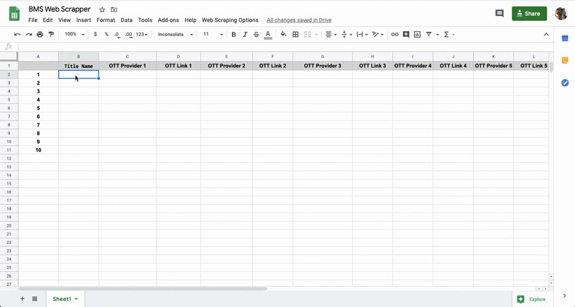

# web-crawler


A simple web crawler that searches OTT providers for a particular TV series or movie.

## JSON API Endpoint

https://bms-web-scrapper.herokuapp.com/search?titles=[slugified-search-string]&json=true

#### Sample Response

```
{
  "data": [
    {
      "title": "friends",
      "poster": "https://images.justwatch.com/poster/177294807/s592",
      "ottProviders": [
        {
          "provider": "Netflix",
          "url": "http://www.netflix.com/title/70153404",
          "icon": "https://images.justwatch.com/icon/430997/s100"
        },
        {
          "provider": "Hotstar",
          "url": "http://www.hotstar.com/1000050598",
          "icon": "https://images.justwatch.com/icon/174849096/s100"
        }
      ]
    }
  ],
  "results": 1
}
```

## Google Sheets Link

https://docs.google.com/spreadsheets/d/1iGvKRLYnDj2GIW1K2wy1bFPIfRF_4njw_69YuTmXcNQ/edit



### Script Code needed in Sheets

```
function onOpen() {
  var ui = SpreadsheetApp.getUi();
  ui.createMenu('Web Scraping Options')
  .addItem('Update All','updateProviders')
  .addItem('Clear All','clearProviders')
  .addToUi();
}

// This function will run whenever we want to clear all OTT provider info
function clearProviders() {
  var sheet = SpreadsheetApp.getActiveSheet();

  for(var row=2; row<=sheet.getLastRow();row++){
    var count = 2;
    for(var i=0; i<20;i++){
      sheet.getRange(row, count).setValue("");
      count++
    }
 }
}


// This function will run whenever we want to update all
function updateProviders() {
  var sheet = SpreadsheetApp.getActiveSheet();

  for(var row=2; row<=sheet.getLastRow();row++){
    var inputTitle = sheet.getRange(row, 2).getValue();
    if(inputTitle === "") continue;

    var apiResponse = UrlFetchApp.fetch("https://bms-web-scrapper.herokuapp.com/search?titles="+inputTitle);
    var response = JSON.parse(apiResponse.getContentText());
    var providers = response.data[0].ottProviders

    var count = 3;
    for(var i=0; i<providers.length;i++){
      sheet.getRange(row, count).setValue(providers[i].provider ? providers[i].provider : '-');
      sheet.getRange(row, count+1).setValue(providers[i].url ? providers[i].url : '-');
      count += 2
    }
 }
}

// This function will run whenever we update a title
function runOnEdit(e) {
 if (e.range.columnStart !== 2 || !e.value || e.range.rowStart === 1) return;
 var inputTitle = e.range.getSheet().getActiveCell().getValue();
 var row = e.range.getSheet().getActiveCell().getRow();

 var apiResponse = UrlFetchApp.fetch("https://bms-web-scrapper.herokuapp.com/search?titles="+inputTitle);
 var response = JSON.parse(apiResponse.getContentText());
 var providers = response.data[0].ottProviders

 var count = 3;
 for(var i=0; i<providers.length;i++){
   e.source.getActiveSheet().getRange(row, count).setValue(providers[i].provider ? providers[i].provider : '-');
   e.source.getActiveSheet().getRange(row, count+1).setValue(providers[i].url ? providers[i].url : '-');
   count += 2
 }
}
```

Made with ️❤︎ by **[Rocky](https://itsrockyy.me/ "Abhijeet Saxena")**
